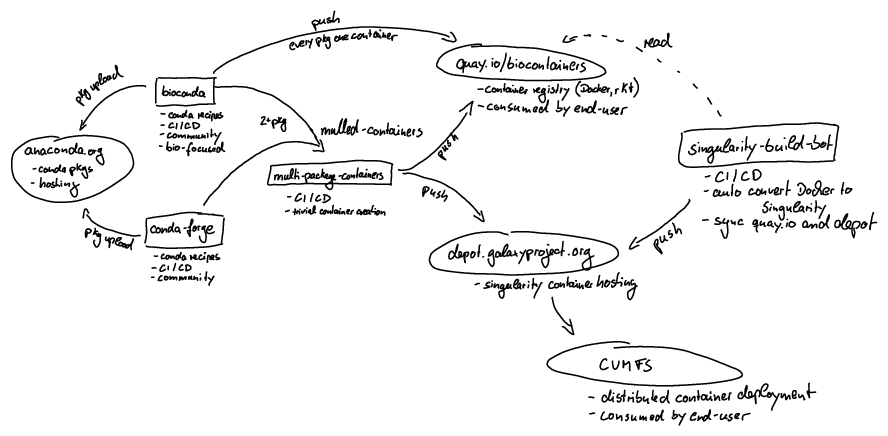

================================
Containers for Tool Dependencies
================================

Galaxy tools (also called wrappers) are able to use both Conda_ packages (see more information in our :doc:`Galaxy Conda
documentation <../conda_faq>`) and Docker_ containers to resolve their dependencies (the actual software "wrapped" as a
Galaxy tool). These dependencies are specified in :doc:`the wrapper XML <../../dev/schema>` using a `requirement
annotation`_ or `container annotation`_, respectively:

.. code-block:: xml

    <requirements>
        <!-- Conda based dependency handling -->
        <requirement type="package" version="1.20">samtools</requirement>
        <!-- Container based dependency handling -->
        <container type="docker">ghcr.io/sokrypton/colabfold:1.5.5-cuda12.2.2</container>
    </requirements>

Most tools, especially those written and maintained by the IUC_, use Conda. The IUC recommends the use of **Conda
package** requirements for tool wrapper developers because:

* Most software wrapped into Galaxy tools are already built into Conda packages maintained by robust software packaging
  communities like Bioconda_ and conda-forge_,
* Software in Bioconda and conda-forge are automatically built into containers by BioContainers_.
* If your Galaxy tool depends on more than one Conda package, :ref:`mulled containers <Mulled containers>` - containers
  with multiple conda requirements - can be easily and automatically be built and hosted for you.

Further, the IUC recommends the use of **Apptainer_ or Singularity_** for Galaxy admins as the primary dependency
resolver, because:

* Docker is typically not supported in HPC environments and is not designed with unprivileged batch-style workloads in
  mind.
* Conda does not strictly pin all dependencies, so the likelihood that a specific older package version is installable
  and usable decreases over time.
* `Mulled containers` are automatically built for Singularity (and Docker) by Bioconda_ and BioContainers_

Together, these provide a solution that can create containers out of Conda packages automatically, which can
subsequently be used by Galaxy administrators to fulfill tool dependencies. Additionally, Galaxy can be configured to
use the same tooling to automatically build containers on-demand and on-the-fly if one matching the requirements is not
already available.

Configuring Galaxy to use containers for tool dependencies
----------------------------------------------------------

In most cases, Galaxy administrators do not need to concern themselves with container creation - they can simply make
use of the infrastructure the Galaxy and Conda communities have created to use existing containers.

TODO: provide a sensible container resolvers config here https://github.com/galaxyproject/galaxy/issues/20105

Automatic build of Linux containers
-----------------------------------

The full ecosystem for end-to-end package-to-container generation and hosting is an interdependent set of utilities,
tooling, and sites maintained by the Bioconda_, conda-forge_, BioContainers_, and Galaxy communities. The ability to
provide and use software as containers in Galaxy is heavily dependent on the `Mulled containers`_ feature of
BioContainers.

At a high level:

1. Conda packages are created and added to Bioconda and conda-forge by Pull Request to their respective recipes
   repositories (`bioconda/bioconda-recipes`_, `conda-forge/staged-recipes`_) on Github.
2. Upon merge of a Bioconda PR, a Docker container for that package is automatically built in CI using involucro_ and
   pushed to the `BioContainers Quay.io organization`_.
3. The `BioContainers multi-package-containers`_ is used to create `Mulled containers` in two ways:
   1. Manual pull requests to add new combinations/versions of packages, and
   2. The Galaxy planemo-monitor_ repository CI scans a list of Git repositories containing Galaxy tool wrappers daily,
      ensures container images for all are available on the BioContainers Quay.io, and submits PRs for any that are
      missing.
4. Upon merge to multi-package-containers, a mulled Docker image is built using involucro_ and uploaded to the
   `BioContainers Quay.io organization`_, converted to Singularity, and uploaded to the `Galaxy Singularity Depot`_.
5. The `BioContainers singularity-build-bot`_ CI periodically scans the BioContainers Quay.io and converts any missing
   images that are not present on the Galaxy Singularity Depot to Singularity and uploads them to the Depot.
6. Singularity images are mirrored hourly from the Depot to CVMFS_ for direct mountability.

The full ecosystem for building and distributing packages and containers is shown in the following diagram:

Mulled containers
-----------------

"Mulled" containers are BioContainers feature which allow multiple distinct top-level Conda packages to be installed
into a single container image. Although a Conda environment always contains many installed packages (almost no Conda
package is entirely self-contained, they all have dependencies), Conda leaves the naming of environments up to the Conda
end user. In the case of a single package, naming the environment for the package you are installing is sensible, e.g.:

.. code-block:: sh-session

    $ conda create --override-channels --strict-channel-priority --channel conda-forge --channel bioconda \
        --name samtools:1.21 samtools=1.21

Naturally, Bioconda packages are similarly named (sometimes with a hash[1]_) when built in to BioContainers:

.. code-block:: sh-session

    $ curl -s https://quay.io/api/v1/repository/biocontainers/samtools | jq -cr '.tags | keys' | grep 1.20
      "1.21--h50ea8bc_0",
      "1.21--h96c455f_1",

When two or more named packages are to be installed in an environment, choosing a name is less straightforward;
Galaxy and BioContainers settled on generating a hash of the requested package names and a hash of their versions. This
provides a stable identifier for any combination of packages and versions.

Thus if installing samtools 1.21 along with bwa 0.7.19, the name hash is::

    fe8faa35dbf6dc65a0f7f5d4ea12e31a79f73e40

And the version hash is::

    bd996097b6dd518cf788ddd6c586fb23d039cb9c

The name hash is prepended with ``mulled-v2-`` to become mulled-v2-fe8faa35dbf6dc65a0f7f5d4ea12e31a79f73e40_,
and the version is appended with a build number (``-0``), resulting in the container image with name:tag::

    mulled-v2-fe8faa35dbf6dc65a0f7f5d4ea12e31a79f73e40:bd996097b6dd518cf788ddd6c586fb23d039cb9c-0

This hash is stable, albeit one-way, so determining a container's contents from its name is not straightforward. We have
developed small utilities for working with mulled containers and the technology stack described above, many of which are
used by the stack itself. They are currently included in the ``galaxy-tool-util`` Python package.

Working with mulled containers
------------------------------

The ``galaxy-tool-util`` package can be installed using ``pip``:

.. code-block:: sh-session

    $ python3 -m venv 'galaxy-tool-util[mulled]'
    $ . ./galaxy/tool-util/bin/activate
    $ pip install galaxy-tool-util

Search for containers
^^^^^^^^^^^^^^^^^^^^^

This will search for Docker containers (in the `BioContainers Quay.io organization`_), Singularity containers (in the
`Galaxy Singularity Depot`_), Conda packages (in the bioconda channel), and GitHub files (on the bioconda-recipes
repository). 

.. code-block:: sh-session

   $ mulled-search --destination quay conda --search samtools bwa

The user can specify the location(s) for a search using the ``--destination`` option. The search term is specified using
``--search``. Multiple search terms can be specified simultaneously; in this case, the search will also encompass
multi-package containers. For example, ``--search samtools bamtools`` will return all versions of
``mulled-v2-0560a8046fc82aa4338588eca29ff18edab2c5aa`` in addition to all individual samtools and bamtools results.

If the user wishes to specify a quay.io organization or Conda channel for the search, this may be done using the
``--organization`` and ``--channel`` options respectively, e.g. ``--channel conda-forge``. Enabling ``--json`` causes
results to be returned in JSON format. Because the quay.io organization is large, results are cached. The amount of time
the cache will be reused for can be changed with ``--cache-time``.

Calculate a mulled hash
^^^^^^^^^^^^^^^^^^^^^^^

Each mulled container is identified with a hash such as ``mulled-v2-8186960447c5cb2faa697666dc1e6d919ad23f3e``. You can
calculate this hash using the ``mulled-hash`` command, submitting a comma-separated list of package names:

.. code-block:: sh-session

   $ mulled-hash samtools=1.3.1,bedtools=2.22
   mulled-v2-8186960447c5cb2faa697666dc1e6d919ad23f3e:d52e471b5bfa168ac813d54fc5dfe7f96ade56e6

The user can specify whether to generate hashes for either version 1 or version 2 containers WITH ``--hash``; version 2 is the default.

A web-based hash generator written by `Moritz E. Beber <https://github.com/Midnighter>` can be found at
https://midnighter.github.io/mulled

Build all packages from bioconda from the last 24h
^^^^^^^^^^^^^^^^^^^^^^^^^^^^^^^^^^^^^^^^^^^^^^^^^^

The Bioconda community builds a container for every package they create with a command similar to this:

.. code-block:: sh-session

   $ mulled-build-channel --channel bioconda --namespace biocontainers \
      --involucro-path ./involucro --recipes-dir ./bioconda-recipes --diff-hours 25 build

Building Docker containers for local Conda packages
^^^^^^^^^^^^^^^^^^^^^^^^^^^^^^^^^^^^^^^^^^^^^^^^^^^

Conda packages can be tested with creating a *busybox* based container for this particular package in the following way.
This also demonstrates how you can build a container locally and on-the-fly.

  > we modified the ``samtools`` package to version 3.0 to make it clear we are using a local version

1) Build your recipe

.. code-block:: bash
   
   $ conda build recipes/samtools

2) Index your local builds

.. code-block:: bash
   
   $ conda index /home/bag/miniconda2/conda-bld/linux-64/

3) Build a container for your local package

.. code-block:: bash
   
   $ mulled-build build-and-test 'samtools=3.0--0' \
      --extra-channel file://home/bag/miniconda2/conda-bld/ --test 'samtools --help'

The ``--0`` indicates the build version of the conda package. It is recommended to specify this number, otherwise
you will override already existing images. For Python Conda packages this extension might look like this ``--py35_1``.

Build, test, and push a conda-forge package to biocontainers
^^^^^^^^^^^^^^^^^^^^^^^^^^^^^^^^^^^^^^^^^^^^^^^^^^^^^^^^^^^^

 > You need to have write access to the biocontainers repository

You can build packages from other Conda channels as well, not only from BioConda. ``pandoc`` tool is available from the
conda-forge channel and conda-forge is also enabled by default in Galaxy. To build ``pandoc`` and push it to biocontainrs
you could do something along these lines.

.. code-block:: bash

   $ mulled-build build-and-test 'pandoc=1.17.2--0' --test 'pandoc --help' -n biocontainers

.. code-block:: bash
  
   $ mulled-build push 'pandoc=1.17.2--0' --test 'pandoc --help' -n biocontainers

Build Singularity containers from Docker containers
^^^^^^^^^^^^^^^^^^^^^^^^^^^^^^^^^^^^^^^^^^^^^^^^^^^

Singularity containers can be built from Docker containers using the ``mulled-update-singularity-containers`` command.

To generate a single container:

.. code-block:: bash

   $ mulled-update-singularity-containers --containers samtools:1.6--0 --logfile /tmp/sing/test.log --filepath /tmp/sing/ --installation /usr/local/bin/singularity

``--containers`` indicates the container name (here ``samtools:1.6--0``), ``--filepath`` the location where the containers should be placed, and ``--installation`` the location of the Singularity installation. (This can be found using ``whereis singularity``.)

Multiple containers can be installed simultaneously by giving ``--containers`` more than one argument:

.. code-block:: bash

   $ mulled-update-singularity-containers --containers samtools:1.6--0 bamtools:2.4.1--0 --filepath /tmp/sing/ --installation /usr/local/bin/singularity

For a large number of containers, it may be more convenient to employ the ``--container-list`` option:

.. code-block:: bash

   $ mulled-update-singularity-containers --container-list list.txt --filepath /tmp/sing/ --installation /usr/local/bin/singularity

Here ``list.txt`` should contain a list of containers, each on a new line.

In order to generate the list file the ``mulled-list`` command may be useful. The following command returns a list of all Docker containers available on the quay.io biocontainers organization, excluding those already available as Singularity containers on https://depot.galaxyproject.org/singularity/ .

.. code-block:: bash

   $ mulled-list --source docker --not-singularity --blacklist blacklist.txt --file output.txt

The list of containers will be saved as ``output.txt``. The (optional) ``--blacklist`` option may be used to exclude containers which should not included in the output; ``blacklist.txt`` should contain a list of the 'blacklisted' containers, each on a new line.

The generated containers should also be tested. This can be achieved by affixing ``--testing test-output.log`` to the ``mulled-update-singularity-containers`` command:

.. code-block:: bash

   $ mulled-update-singularity-containers --container-list list.txt --filepath /tmp/sing/ --installation /usr/local/bin/singularity --testing test-output.log

.. _Conda: https://conda.org/
.. _Docker: https://www.docker.com/
.. _requirement annotation: https://docs.galaxyproject.org/en/latest/dev/schema.html#tool-requirements-requirement
.. _container annotation: https://docs.galaxyproject.org/en/latest/dev/schema.html#tool-requirements-container
.. _Bioconda: https://bioconda.github.io/
.. _conda-forge: https://conda-forge.org/
.. _IUC: https://galaxyproject.org/iuc/
.. _BioContainers: https://github.com/biocontainers
.. _BioContainers multi-package-containers: https://github.com/BioContainers/multi-package-containers
.. _BioContainers singularity-build-bot: https://github.com/BioContainers/singularity-build-bot
.. _bioconda/bioconda-recipes: https://github.com/bioconda/bioconda-recipes
.. _conda-forge/staged-recipes: https://github.com/conda-forge/staged-recipes
.. _planemo-monitor: https://github.com/galaxyproject/planemo-monitor
.. _Apptainer: https://apptainer.org/
.. _Singularity: https://sylabs.io/singularity/
.. _involucro: https://github.com/involucro/involucro
.. _BioContainers Quay.io organization: https://quay.io/organization/biocontainers
.. _Galaxy Singularity Depot: https://depot.galaxyproject.org/singularity
.. _CVMFS: https://cernvm.cern.ch/fs/
.. _Bioconda build number standard: https://bioconda.github.io/faqs.html#what-s-the-difference-between-a-build-number-and-a-package-version
.. _mulled-v2-fe8faa35dbf6dc65a0f7f5d4ea12e31a79f73e40: https://quay.io/repository/biocontainers/mulled-v2-fe8faa35dbf6dc65a0f7f5d4ea12e31a79f73e40

.. [1] The hash is an artifact of the `Bioconda build number standard`_, Conda has separate fields for version and build
   number, whereas Docker only has the tag, where BioContainers combines both version number and build number.
